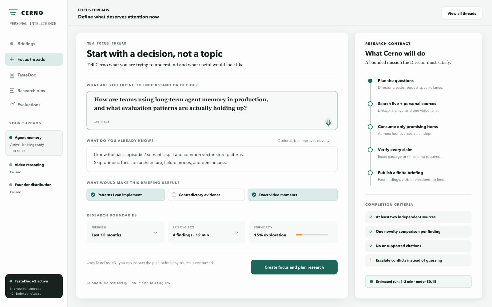
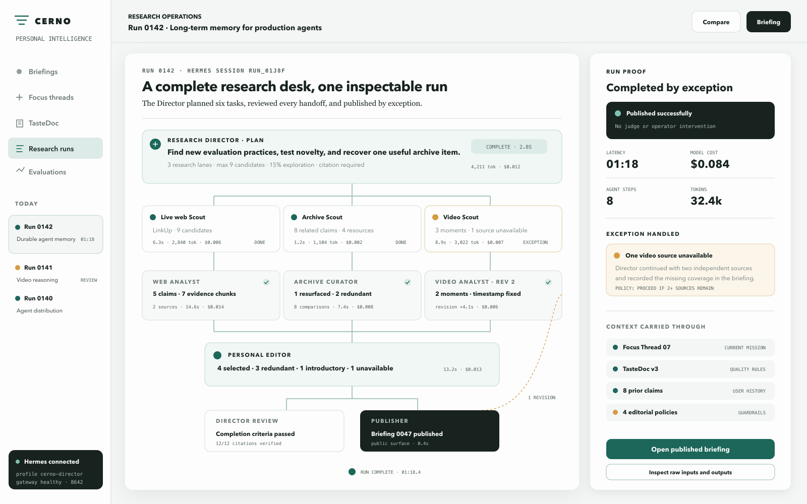
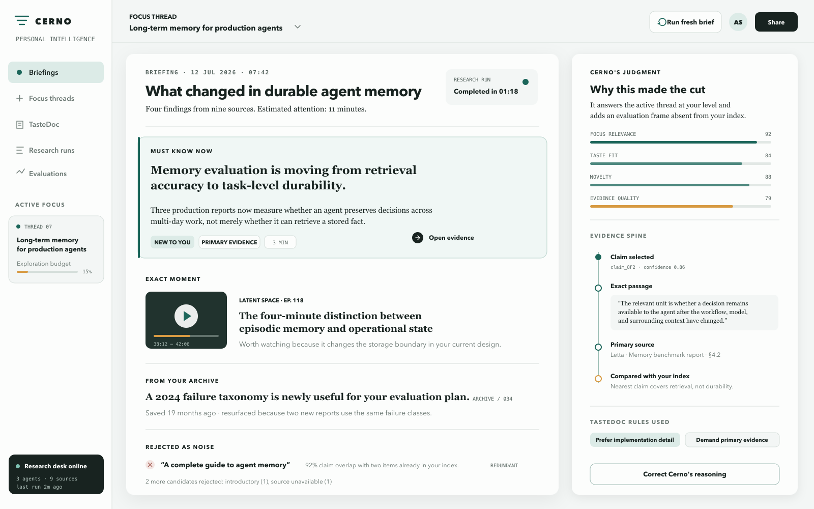
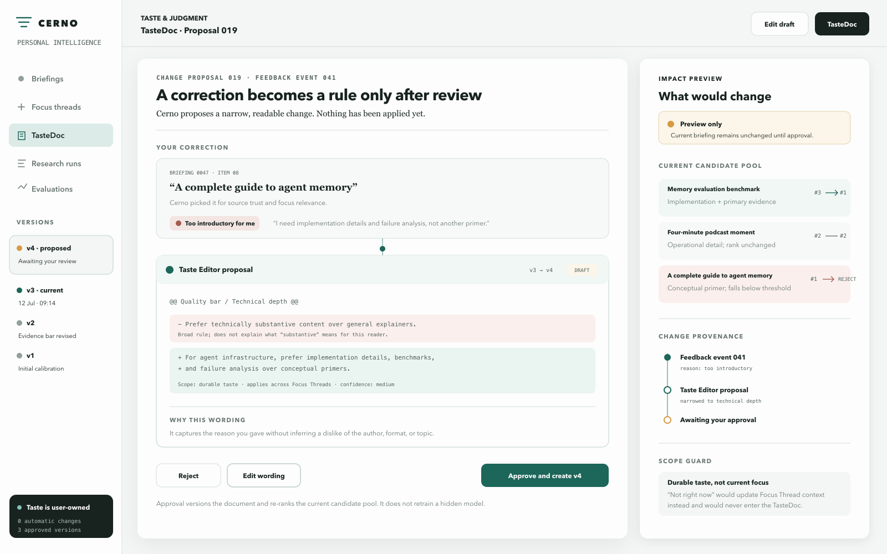

# Cerno UI mocks

These are static design-preparation artifacts only. They intentionally contain no application logic, API integration, or reusable frontend implementation.

For a fixture-only click-through of this flow, see [`../prototype/`](../prototype/). The prototype uses local React state and simulated events; it has no production integration or research logic. Its Focus Thread screen intentionally extends the static mock with current-work, desired-outcome, and source-boundary fields, so the SVG/PNG remains the visual baseline rather than an exact screen inventory.

## Direction

Read [`DESIGN-DIRECTION.md`](./DESIGN-DIRECTION.md) for the visual thesis, tokens, layout, evidence-spine signature, and design critique.

## Core flow

### 1. Define the mission

The user starts with a decision or research question, states what they already know, and chooses useful-output criteria. The right side turns the form into an explicit research contract with completion criteria.

Files:

- [`cerno-new-focus.svg`](./cerno-new-focus.svg)
- [`cerno-new-focus.png`](./cerno-new-focus.png)

### 2. Inspect the work

The run view makes Hermes' Director → specialist tree inspectable. It shows context carried through handoffs, one real revision, an exception handled without operator intervention, and per-step latency/cost.

Files:

- [`cerno-research-run.svg`](./cerno-research-run.svg)
- [`cerno-research-run.png`](./cerno-research-run.png)

### 3. Consume the finite briefing

The briefing is a bounded document, not a feed. Selecting a finding opens its evidence spine: exact passage, primary source, nearest personal-index claim, component judgment, and TasteDoc rules.

Files:

- [`cerno-briefing-workspace.svg`](./cerno-briefing-workspace.svg)
- [`cerno-briefing-workspace.png`](./cerno-briefing-workspace.png)

### 4. Correct the reasoning

Feedback produces a proposed, readable TasteDoc diff. The user sees the ranking impact before approval; no hidden profile change occurs. Contextual feedback such as “not right now” stays in the Focus Thread instead of contaminating durable taste.

Files:

- [`cerno-tastedoc-change.svg`](./cerno-tastedoc-change.svg)
- [`cerno-tastedoc-change.png`](./cerno-tastedoc-change.png)

## Two-minute demo path

1. Open **New Focus Thread** with the mission prefilled; click **Create focus and plan research**.
2. Land on **Research Run** and watch Hermes create a request-specific plan and specialist tree.
3. Open **Briefing** when publication completes; play the exact video moment and open one evidence spine.
4. Show **Rejected as noise** for a redundant candidate.
5. Click **Correct Cerno's reasoning**, choose **Too introductory for me**, and open the proposed TasteDoc diff.
6. Approve v4 and show the impact preview/re-ranking.

For stage reliability, steps 1–3 should be one real live run. The TasteDoc interaction can operate on that freshly published briefing without starting another full research run.