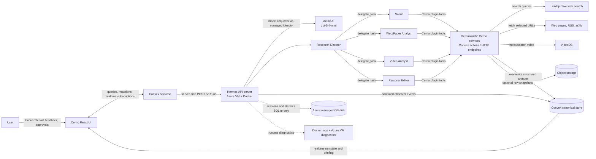
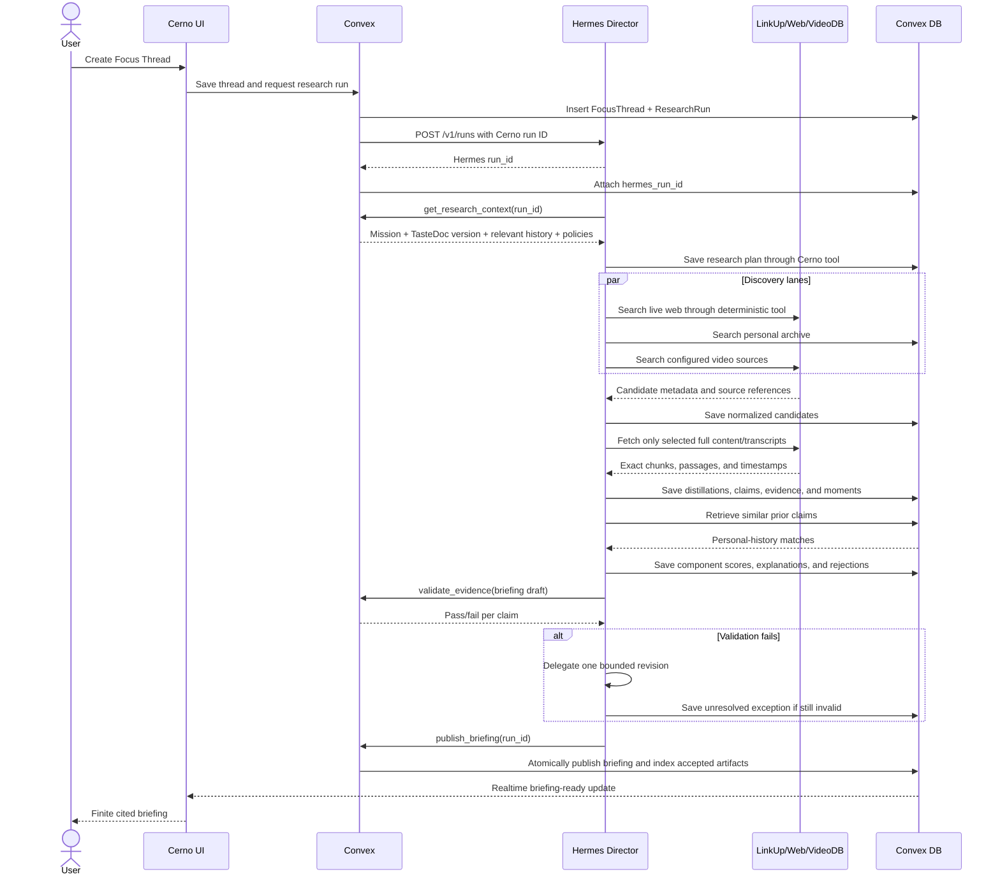
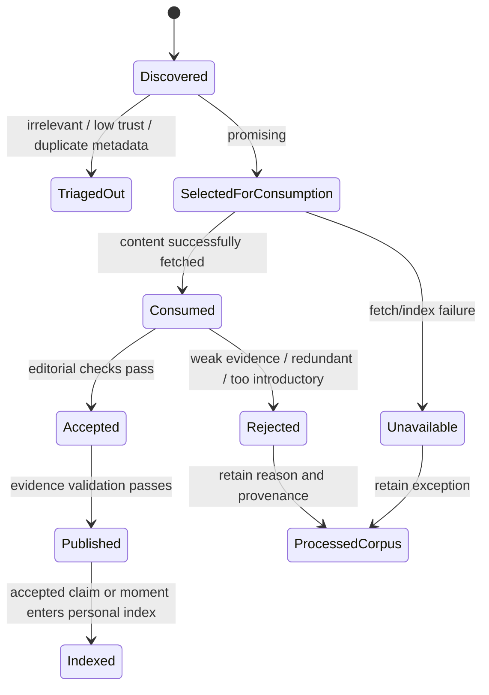
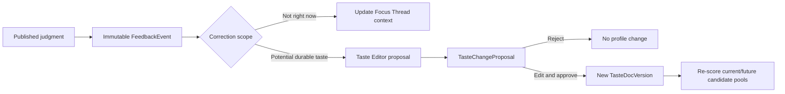

# Cerno technical architecture and data flow

> A concrete map of what Cerno fetches, how it is processed, and where each artifact lives.

## 1. Current state versus target state

### What exists now

- `prototype/` remains a React/Vite **fixture-only design artifact**.
- `app/` is the production-path React/Vite application backed by a complete Convex schema.
- Focus Threads, immutable run snapshots, candidates, fetched source chunks, claims, judgments, briefings, feedback, and TasteDoc versions persist in Convex and update the UI through subscriptions.
- A scheduled Convex action uses LinkUp for live discovery and full primary-source fetches. Search snippets remain metadata only.
- When the video lane is selected, the action sends at most one discovered long-form video to VideoDB, reuses its persisted asset ID, builds a spoken-word index, searches relevant moments, and retrieves timestamped transcript segments plus playable stream links.
- The action submits fetched source excerpts, VideoDB transcript moments, and personal context to the restricted Azure-hosted Hermes Runs API. Hermes performs Director-led native `delegate_task` review; its run ID, usage, and delegation event are persisted.
- Deterministic publication code exact-matches every evidence quote, builds a locator and content hash, and refuses to publish fewer than three validated findings when three sources are available.
- Structured feedback creates either Focus Thread context or a reviewable TasteDoc proposal. Approval creates a new immutable TasteDoc version.
- The current Convex deployment is local and anonymous with an explicit development-only auth bypass. Firebase Google sign-in, Convex token verification, and identity-owned workspace checks are implemented for deployment.
- The VideoDB evidence lane is implemented through the deterministic Convex bridge. The project-local Hermes Cerno plugin remains unimplemented; Hermes never receives database or unrestricted source tools.

### Target MVP

Use four clear boundaries:

1. **Browser:** display and user input only.
2. **Convex:** Cerno application backend and canonical product database.
3. **Hermes on Azure:** agent orchestration and bounded judgment, not canonical memory.
4. **External source services:** discovery and content processing, such as LinkUp, webpage fetchers, and VideoDB.

## 2. System map



## 3. The complete user-to-briefing flow



## 4. What gets fetched

| Stage | Fetched data | From | When | Persisted form |
|---|---|---|---|---|
| Focus setup | User question, known context, goals, freshness, size, serendipity | Browser | User submits | `FocusThread` and immutable run input snapshot |
| Personal context | Current TasteDoc rules, relevant old claims/resources, active policies | Convex | Start of run and specialist handoffs | Referenced by IDs and version numbers in run/step records |
| Live discovery | URL, title, author/source, date, snippet, content type | LinkUp or source adapter | Scout discovery | Normalized `Candidate` records |
| Web analysis | Selected page/paper text plus location metadata | Original URL, RSS, arXiv, fetch service | Only after triage | `SourceChunk`, `Distillation`, `Claim`, `Evidence` |
| Video analysis | Video metadata, transcript chunks, timestamps, clip references | VideoDB | Only for selected videos | `SourceChunk`/`Moment`; VideoDB asset and index IDs |
| Archive comparison | Similar accepted claims and previously rejected candidates | Convex personal index | Before scoring | Similarity links and novelty/redundancy judgment |
| Model output | Plans, structured specialist results, editorial reasoning | Azure AI through Hermes | During run | Structured Cerno artifacts plus bounded trace events |
| Feedback | Typed reason and optional user note | Browser | User corrects an explanation | Immutable `FeedbackEvent` |
| Taste update | Proposed readable rule diff | Taste Editor | On demand/nightly later | `TasteChangeProposal`; approved result becomes a new `TasteDocVersion` |

### Fetch policy

Discovery results are **not evidence**. A search snippet may create a candidate, but Cerno must fetch the primary source and preserve an exact chunk or timestamp before publishing a claim.

Use progressive depth to control time and cost:

```text
many search results
    ↓ cheap metadata triage
few normalized candidates
    ↓ relevance/source screening
very few full-content fetches
    ↓ claim and evidence extraction
finite briefing
```

## 5. Where data is stored

### Canonical product data: Convex

Convex should be the source of truth for anything the user expects Cerno to remember:

| Collection | Purpose | Important fields |
|---|---|---|
| `users` | Owner/account boundary | identity provider ID, settings |
| `sources` | Followable channels/feeds/authors | type, external ID, trust stats, enabled state |
| `focusThreads` | Current temporary research goals | question, known context, boundaries, status |
| `tasteDocVersions` | Legible durable taste history | version, markdown/structured rules, approval metadata |
| `researchRuns` | One end-to-end mission | focus snapshot, TasteDoc version, status, Hermes run ID, cost, latency |
| `agentSteps` | Inspectable delegation tree | role, parent step, inputs, outputs, status, usage, exception |
| `candidates` | Every discovered item considered | normalized source metadata, discovery provenance, triage status |
| `sourceChunks` | Exact evidence-bearing text | item ID, locator, text, content hash |
| `distillations` | Structured result of consuming an item | summary, topics, entities, analyst/version metadata |
| `claims` | Atomic statements extracted from sources | text, confidence, accepted/indexed state |
| `evidence` | Claim-to-source proof | claim ID, chunk ID or moment ID, quote, locator |
| `moments` | Relevant audio/video windows | VideoDB asset ID, start/end time, transcript, clip URL/reference |
| `judgments` | Personal signal decision | component scores, explanation, TasteDoc rules used, verdict |
| `briefings` | Published finite output | run ID, ordered sections, publication status |
| `feedbackEvents` | Immutable user corrections | target judgment, typed reason, note, scope |
| `tasteChangeProposals` | Reviewable feedback-to-rule diffs | source events, old/new wording, status |
| `runEvents` | Sanitized observability stream | Hermes IDs, event type, timing, bounded payload |
| `evaluationCases` | Fixed regression examples | expected rank/verdict/evidence behavior |

Accepted and rejected material remain separate **states**, not separate untraceable systems:

- The **processed corpus** is all candidates, chunks, judgments, and rejection reasons.
- The **personal index** is the subset of accepted claims, moments, and resources marked retrievable.

A Convex vector index can support nearest-claim retrieval, while readable claim text and the resulting novelty decision remain stored explicitly.

### Large/raw content: object storage (recommended boundary)

Do not put large binaries into Convex documents.

- Web/article MVP: store the exact evidence chunks in Convex. Optionally store a compressed raw source snapshot in Azure Blob Storage, Cloudflare R2, or S3 and save its URI/hash in Convex.
- Video: let VideoDB retain/index the media and transcript; save only VideoDB IDs, selected transcript chunks, timestamps, and clip references in Convex.
- Never duplicate a full video into Convex.

Object storage is not currently implemented or selected. It can be deferred for the first vertical slice if exact source chunks and content hashes are persisted.

### Hermes state: VM-local managed disk

The VM bind-mounts `/opt/cerno-hermes/data` into the Hermes container at `/opt/data`. This normal POSIX filesystem stores Hermes configuration, sessions, and SQLite runtime state. Azure Files/SMB was rejected because Hermes' SQLite WAL locking and s6 log permission changes are not compatible with that mount. This is operational orchestration state only.

It must **not** become the canonical store for:

- TasteDoc
- Focus Threads
- Personal index
- Briefings
- Feedback
- Evidence

If Hermes state is deleted, Cerno's product history should still be intact in Convex.

### Operational logs: VM and Docker diagnostics

The current deployment retains Hermes gateway logs on the managed disk and exposes VM/container diagnostics through Azure VM Run Command. Central Log Analytics shipping is not configured yet. These logs are for uptime and infrastructure debugging, not product memory or user-visible traces.

The user-visible trace should come from sanitized Hermes observer events persisted in Convex.

### Local browser state

Use browser state only for temporary form/UI state. Secrets, canonical research artifacts, and durable profile data must never depend on `localStorage` or React state.

## 6. Proposed state transitions



Nothing should silently disappear. Rejections and failures remain inspectable and prevent repeated waste.

## 7. Agent responsibilities versus deterministic code

| Component | Makes judgments? | Reads/writes through |
|---|---:|---|
| Research Director | Yes: plan, delegate, review, exception decision | Narrow Cerno plugin tools |
| Scout | Yes: candidate relevance and lane selection | Search/archive tools |
| Web/Paper Analyst | Yes: claims and useful evidence | Fetch/read and save-claim tools |
| Video Analyst | Yes: useful moments | VideoDB search/transcript tools |
| Personal Editor | Yes: novelty, redundancy, taste fit | Retrieval and save-judgment tools |
| Taste Editor | Yes: narrow readable profile change | Feedback and proposal tools |
| Source adapters | No | Deterministic API clients |
| Evidence validator | No | IDs, hashes, locators, citation rules |
| Database writes | No | Validated Convex mutations |
| Briefing publication | No final improvisation | Transaction/check over persisted artifacts |

Agents must never receive direct database credentials or write arbitrary records. Cerno tools validate schemas, permissions, IDs, and publication invariants.

## 8. Feedback and TasteDoc flow



A correction never silently retrains or mutates an opaque user model. Durable taste changes require a visible versioned approval.

## 9. Secrets and trust boundaries

- `LINKUP_API_KEY`, Hermes bearer key, VideoDB key, and Convex admin credentials are server-side only.
- The browser talks to Convex using authenticated public functions; it never calls Hermes or source providers directly.
- Convex calls Hermes with `Authorization: Bearer ...` and an idempotency key.
- Use the Cerno `researchRun` ID as Hermes `session_id` to join events without guesswork.
- Hermes-to-Azure-AI authentication uses the VM's system-assigned managed identity; no model key is stored in the container.
- Hermes observer payloads must be bounded and sanitized before persistence. Do not log secrets, full private archives, or unnecessary source bodies.
- Public briefing/share views need an explicit access model; database IDs alone are not authorization.

## 10. Smallest credible implementation order

1. **Convex schema and auth** — Focus Threads, TasteDoc versions, runs, candidates, claims/evidence, judgments, briefings, feedback.
2. **One vertical source lane** — LinkUp discovery plus deterministic webpage fetch; normalize and preserve exact chunks.
3. **Hermes Cerno plugin** — context, candidate, fetch, claim, editorial, validation, and publish tools.
4. **Run bridge** — Convex action starts Hermes, stores `hermes_run_id`, receives/polls events, and supports stop/retry.
5. **Real briefing UI** — replace fixture data with Convex queries/subscriptions; expose citations and rejections.
6. **Personal index retrieval** — accepted claims plus vector similarity for novelty/redundancy.
7. **Video lane — implemented** — VideoDB asset reuse, spoken-word indexing, semantic transcript search, exact moments, and playable stream references.
8. **Feedback loop** — immutable correction, proposed TasteDoc diff, approval, versioning, and re-score.
9. **Evaluation suite** — repeated runs checking rank quality, duplicate rejection, citation validity, and timestamp correctness.

## 11. First end-to-end acceptance test

A run is real only if all of these are observable in persisted data:

1. User-created Focus Thread exists in Convex.
2. ResearchRun records both the Cerno ID and actual Hermes run ID.
3. Scout saves live candidates with discovery provenance.
4. At least one selected source is fetched beyond its search snippet.
5. Every published claim points to an exact source chunk or video timestamp.
6. At least one rejected candidate retains a reason.
7. Personal Editor compares a finding with prior indexed claims.
8. Evidence validator passes before briefing publication.
9. UI loads the briefing and trace from Convex, not fixtures.
10. Feedback creates an immutable event and a reviewable TasteDoc proposal.
